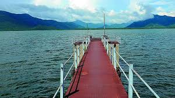
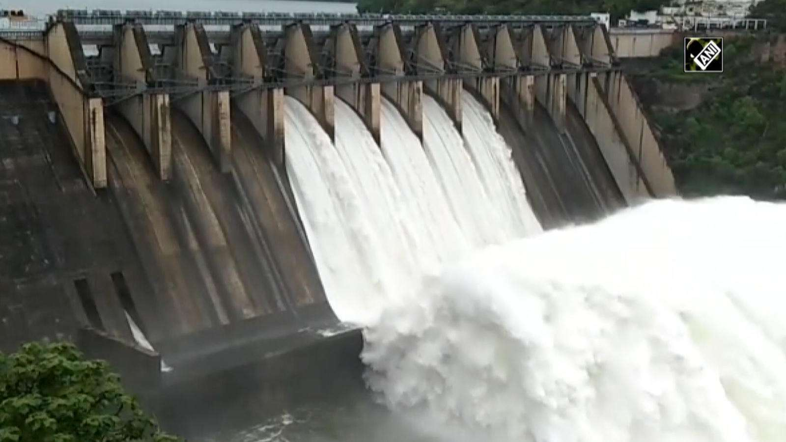

# YELESWARAM:                                           
[Address](add.md)

[Famous placeses](pic.md)

[Map](https://www.google.com/maps/search/yeleswaram+yeleru+project/@17.3106141,82.0169757,12z/data=!3m1!4b1)                

 

## About (Yeleswaram)::
 Yeleswaram is one of the coolest and pleasant places in East Godavari.
 It is near Yerravaram (NH16) located near to  National high way Vizag to Rajahmundry.
 Yeleswaram is a rural place and it contains some tourist places.
   
### 1.Yeleru project---
   

 
 

 **Irrigation-project-name**: _Yeleru Reservoir project ph-1_

 **Purpose**: _Irrigation_

 **Type**: _Major Storage_

 **Capacity-of-project**: _24.110 TMC_

### 2.Water Falls--

 

 So most of the local tourists are visited these places and enjoyed.
 mostly these places are near to [Bhupathipalem Reservoir](Bhupathi.jpeg)

<audio ref='Water falls Bgm sound' src="Water-fall-BGM.mp3" autoplay loop></audio>

 **---------------------------------------- _Manikanta siva_**

